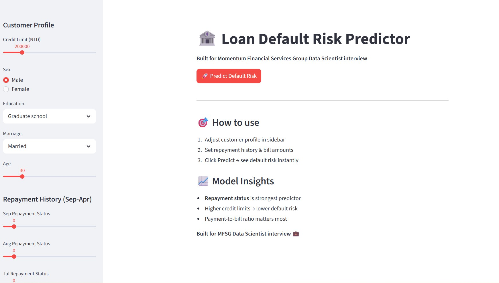
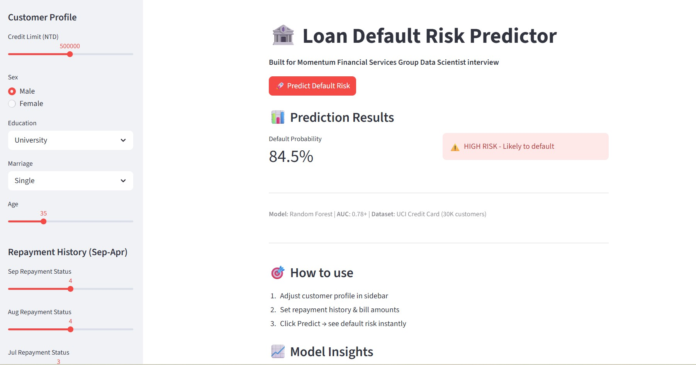
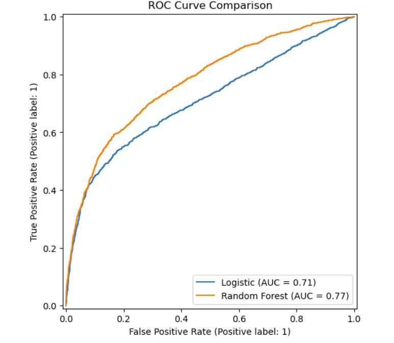

# Loan Default Prediction

A machine learning project that predicts whether a credit card customer is likely to default on payment next month using the UCI Default of Credit Card Clients dataset. This project includes data preprocessing, exploratory data analysis, feature engineering, model training, evaluation, and a Streamlit web application for interactive prediction.

## Project Objective

The goal of this project is to build a credit risk prediction model that can classify customers as likely to default or not default based on demographic information, credit limit, repayment history, billing amount, and payment behavior.

This project was created as part of my data science portfolio and interview preparation for financial analytics and risk modeling roles.

## Dataset

- **Source:** UCI Machine Learning Repository
- **Dataset Name:** Default of Credit Card Clients
- **Records:** 30,000 customers
- **Target Variable:** `default_payment_next_month`
- **Problem Type:** Binary classification

The dataset contains:
- Customer demographics
- Credit limit information
- Repayment history from April 2005 to September 2005
- Bill statement amounts
- Previous payment amounts

## Tools and Technologies

- Python
- Jupyter Notebook
- Pandas
- NumPy
- Matplotlib
- Seaborn
- Scikit-learn
- Joblib
- Streamlit

## Project Workflow

1. Data loading and inspection
2. Data cleaning and validation
3. Exploratory data analysis
4. Feature engineering
5. Train-test split
6. Model training using Logistic Regression and Random Forest
7. Model evaluation using classification metrics and ROC-AUC
8. Saving the best model with Joblib
9. Building a Streamlit app for interactive predictions

## Feature Engineering

Additional business-focused features were created to improve model performance:

- `AVG_BILL`
- `TOTAL_BILL`
- `AVG_PAY`
- `TOTAL_PAY`
- `PAY_TO_BILL_RATIO`
- `AVG_REPAY_STATUS`

These features help summarize repayment behavior and billing trends across multiple months.

## Models Used

### 1. Logistic Regression
Used as a baseline model for interpretable classification.

### 2. Random Forest Classifier
Used as the final model because it captured non-linear relationships better and delivered stronger predictive performance.

## Model Evaluation

The models were evaluated using:

- Accuracy
- Precision
- Recall
- F1-score
- Confusion Matrix
- ROC-AUC

The Random Forest model was selected as the best-performing model for the Streamlit app.

## Key Insights

- Repayment status was one of the strongest predictors of default risk.
- Customers with repeated delayed payments had significantly higher default probability.
- Payment-to-bill ratio was an important signal of financial stress.
- Lower credit limits and lower repayment amounts often aligned with higher risk.

## Streamlit App

The project includes an interactive Streamlit application where users can:

- Enter customer profile data
- Adjust repayment history and financial values
- Predict default probability instantly
- View low-risk or high-risk classification output

## Screenshots

### App Home


### Prediction Result - High Risk


### Prediction Result - Low Risk


### Model Results


## Project Structure

```bash
loan-default-prediction/
│
├── loan-default-prediction.ipynb
├── app.py
├── loan_default_model.pkl
├── requirements.txt
├── README.md
└── images/
    ├── app-home.png
    ├── app-result.png
    └── model-results.png
```

## How to Run the Project

### 1. Clone the repository
```bash
git clone https://github.com/YOUR-USERNAME/loan-default-prediction.git
cd loan-default-prediction
```

### 2. Install dependencies
```bash
pip install -r requirements.txt
```

### 3. Run the Streamlit app
```bash
streamlit run app.py
```

## Future Improvements

- Hyperparameter tuning
- Probability threshold optimization
- Model explainability using SHAP
- Deployment on Streamlit Community Cloud
- Better UI design and validation rules

## Author

**Thully**  
Toronto, Ontario, Canada  
Data Analytics and Machine Learning Portfolio Project
